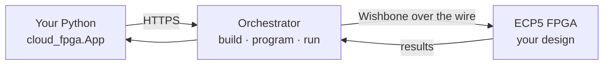

---
hide:
  - navigation
  - toc
---

<div class="mr-hero">
  <div class="mr-grid-bg"></div>
  <span class="mr-eyebrow"><span class="dot"></span> Early prototype · v0.1</span>
  <h1 class="mr-head">Cloud FPGA infrastructure<br><em>for hardware-reasoning agents</em></h1>
  <p class="mr-lede">Write a hardware design in Python, run it on a real remote FPGA, and read back results — in a few lines of code.</p>
  <div class="mr-cta">
    <a class="mr-btn mr-btn-primary" href="guides/quickstart/">Quickstart →</a>
    <a class="mr-btn mr-btn-ghost" href="guides/sdk/">Python SDK</a>
  </div>
</div>

Open-source FPGA toolchains in the cloud — fast, verifiable reward loops for
reinforcement learning on hardware reasoning. Manhattan Reasoning runs a pool of
10 [Lattice ECP5](https://www.latticesemi.com/en/Products/DevelopmentBoardsAndKits/ECP5EvaluationBoard)
FPGAs behind a single API: submit an [Amaranth HDL](https://amaranth-lang.org/)
design, the service builds it (Yosys → nextpnr-ecp5 → ecppack) and programs it
onto a board, and you run memory-mapped transactions against the live hardware.

!!! warning "Early prototype"
    The infrastructure is under active development. Endpoints, payloads, and the
    SDK surface may change. See [Troubleshooting](guides/troubleshooting.md) for
    current known issues.

## The fast path: the SDK

The [`cloud_fpga`](guides/sdk.md) Python package wraps the whole lifecycle —
build, program, register I/O, release — behind a small decorator API. No manual
job polling.

```python
import cloud_fpga

class Regs(cloud_fpga.RegisterMap):
    DATA_IN  = 0x0004
    DATA_OUT = 0x0008

app = cloud_fpga.App(
    "my_design",
    design="design.py",
    fpga_id=0,
    registers=Regs,
    api_key=cloud_fpga.secret("CLOUD_FPGA_API_KEY"),
)

@app.local_entrypoint()
def main():
    with app:                       # programs the FPGA, releases on exit
        app.write(Regs.DATA_IN, 0xDEADBEEF)
        print(hex(app.read(Regs.DATA_OUT)))
```

```bash
cloud-fpga run my_design.py
```

## Start here

<div class="grid cards" markdown>

-   :material-rocket-launch: **[Quickstart](guides/quickstart.md)**

    Install the SDK and run the SAT solver on real hardware in five minutes.

-   :material-language-python: **[Python SDK](guides/sdk.md)**

    `App`, register maps, `read`/`write`, entrypoints, and sessions.

-   :material-console: **[CLI](guides/cli.md)**

    `cloud-fpga run / status / read / write / reset` and friends.

-   :material-flask: **[Examples](examples/index.md)**

    A SAT solver, a BERT feed-forward layer, and a minimal smoke test.

-   :material-sitemap: **[Architecture](concepts/architecture.md)**

    How sessions, jobs, and the FPGA state machine fit together.

-   :material-api: **[REST API](api/rest.md)**

    The lower-level HTTP contract the SDK is built on.

</div>

## How it works



1. **Submit** an Amaranth design — the orchestrator builds and programs it onto an
   idle FPGA.
2. **Run** Wishbone read/write transactions against your live design's registers.
3. **Release** the board back to idle when you're done.

The SDK does all three for you; the [REST API](api/rest.md) exposes each step
directly if you'd rather drive it yourself.
